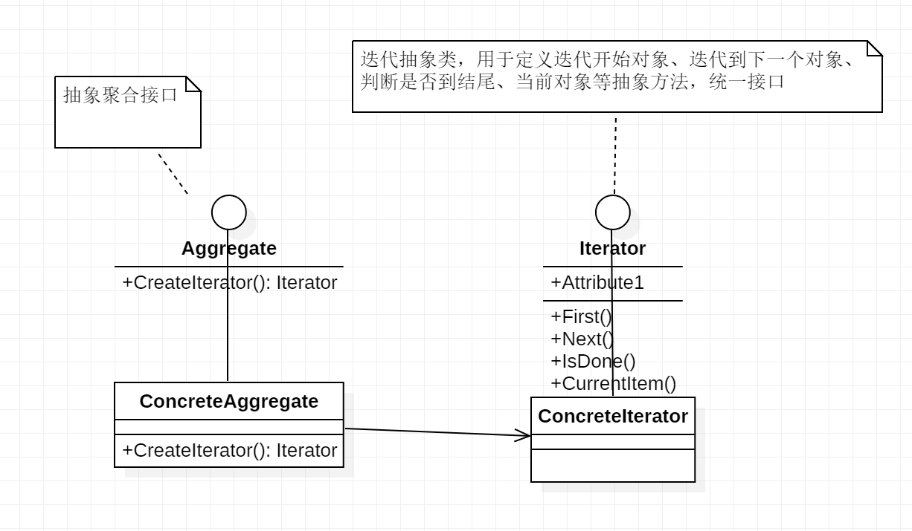

### 迭代器模式

> 迭代器模式（Iterator），提供一种方法顺序访问一个聚合对象中的各种元素，而又不暴露该对象的内部表示。

#### 适用性

1. 访问一个聚合对象的内容而无需暴露它的内部表示
2. 支持对聚合对象的多种遍历
3. 为遍历不同的聚合结构提供一个统一的接口

#### 缺点

1. 迭代器模式算是将一个对象（容器）的存储职责和遍历职责分离了，就像第一个栗子中说的，新增一个容器类就要新增一个迭代器类，增加了系统的代码量和复杂性。

#### 类图



#### 角色

- 抽象聚合类: 定义一个抽象的容器

- 具体聚合类: 实现上面的抽象类，作为一个容器，用来存放元素，等待迭代
- 抽象迭代器: 迭代器接口，每个容器下都有一个该迭代器接口的具体实现
- 具体迭代器: 根据不同的容器，需要定义不同的具体迭代器，定义了游标移动的具体实现

#### 实现

1. 创建抽象容器结构体

```go
 // 容器接口
 type IAggregate interface {
 	Iterator() IIterator
 }
```

2. 创建抽象迭代器

```go
 // 迭代器接口
 type IIterator interface {
     HasNext() bool
     Current() int
     Next() bool
 }
```

迭代器的基本需求，需要有判定是否迭代到最后的方法`HasNext()`,需要有获得当前元素的方法`Current()`,需要有将游标移动到下一个元素的方法 `Next()`

3. 实现容器

```go
  // 具体容器
  type Aggregate struct {
    container []int // 容器中装载 int 型容器
  }
  // 创建一个迭代器，并让迭代器中的容器指针指向当前对象
  func (a *Aggregate) Iterator() IIterator {
       i := new(Iterator)
       i.aggregate = a
       return i
   }
```

4. 实现迭代器

```go
 type Iterator struct {
     cursor    int // 当前游标
     aggregate *Aggregate // 对应的容器指针
 }
 
 // 判断是否迭代到最后，如果没有，则返回true
 func (i *Iterator) HasNext() bool {
     if i.cursor+1 < len(i.aggregate.container) {
         return true
     }
     return false
 }
 
 // 获取当前迭代元素（从容器中取出当前游标对应的元素）
 func (i *Iterator) Current() int {
     return i.aggregate.container[i.cursor]
 }
 
 // 将游标指向下一个元素
 func (i *Iterator) Next() bool {
     if i.cursor < len(i.aggregate.container) {
         i.cursor++
         return true
     }
     return false
 }
```

5. 使用迭代器

```go
 func main() {
     // 创建容器，并放入初始化数据
     c := &Aggregate{container: []int{1, 2, 3, 4}}
     // 获取迭代器
     iterator := c.Iterator() 
     for {
     	// 打印当前数据
 	    fmt.Println(iterator.Current())
 	    // 如果有下一个元素，则将游标移动到下一个元素
 	    // 否则跳出循环，迭代结束
 	    if iterator.HasNext() {
 		    iterator.Next()
 	    } else {
 		    break
 	    }
     }
 }
```

#### 项目中使用

目前的项目中列表的item使用到了分帧加载，比如商店的道具，鱼类百科的大量item的加载，为了使打开这些预制件不至于卡顿使用了分帧加载，而每一帧的加载使用的就是迭代器的原理，用了ES6语法中generator，通过*、yield语法实现，这个就是迭代器、生成器的原理。

项目中使用了迭代器每一帧结束后next()下一个预制件加载处理，从而达到分帧加载的效果，让预制件不是一次性全部大量渲染出来造成卡顿，让每一帧去分担渲染工作，让draw call缓慢增长，而不是从0到100的陡增。

迭代器原理在项目中还是用到的不少的，目前做的项目，比如弹框顺序问题可以考虑使用迭代器原理去优化，而不是之前的那种一个个添加，不是集中在一个地方处理，很容易造成问题的，修改了这个，忘了那个的地方，也会少出现弹框叠加的尴尬局面。