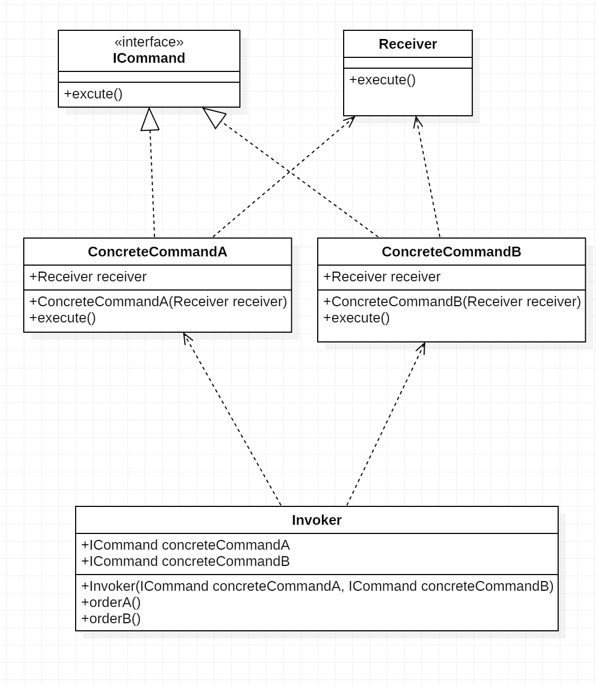

### 命令模式

> 对于“行为请求者”和“行为实现者”，将一组行为抽象为对象，实现二者的松耦合.
>
> 通过把一个请求封装成一个对象，从而可以使用不同的请求例如命令等将客户端参数化；可以将请求排队或者记录请求日志，可以支持请求撤销操作；命令模式是一个对象行为模式，别名为动作模式或者事务模式；
> 命令模式在将一个请求封装成一个对象后，无需了解请求激活的动作或者接收该请求后处理的细则；
> 这是一种两台机器之间通信性质的模式，命令模式解耦了发送者和接受者之间的联系，发送者调用一个操作，接收者执行该操作，发送者无需知道接收者对于该操作的任何接口。

#### 角色

- Command:抽象命令接口.
- ConcreteCommand:具体命令.
- Receiver:最终执行命令的对象.
- Invoker:命令对象的入口.



#### 代码实现

```java
// Command
public interface ICommand {
	void execute();
}

// Receiver
public class Receiver {
   public void execute(){
       System.out.println("receiver execute ... ");
   }
}

// ConcreteCommand
public class ConcreteCommandA implements ICommand {
    private Receiver receiver;
    public ConcreteCommandA(Receiver receiver){
            this.receiver = receiver;
    }
    @Override
    public void execute() {
        System.out.println("ConcreteCommandA execute ...");
        receiver.execute();
    }
}
public class ConcreteCommandB implements ICommand {
    private Receiver receiver;
    public ConcreteCommandB(Receiver receiver){
        this.receiver = receiver;
    }
    @Override
    public void execute() {
        System.out.println("ConcreteCommandB execute ...");
        receiver.execute();
    }
}

// Invoker
public class Invoker {
    private ICommand concreteCommandA, concreteCommandB;
    public Invoker(ICommand concreteCommandA, ICommand concreteCommandB){
        this.concreteCommandA = concreteCommandA;
        this.concreteCommandB = concreteCommandB;
    }
    public void orderA(){
        concreteCommandA.execute();
    }
    public void orderB(){
        concreteCommandB.execute();
    }
}

// 调用
public static void main(String[] args) {
    Receiver receiver = new Receiver();
    Invoker invoker = new Invoker(new ConcreteCommandA(receiver), new ConcreteCommandB(receiver));
    invoker.orderA();
    invoker.orderB();
}

// 输出
ConcreteCommandA execute ...
receiver execute ... 
ConcreteCommandB execute ...
receiver execute ... 
```

#### 优点

- 降低耦合度.
- 新增一个命令/一组命令简单.
- 调用同一方法实现不同功能.

#### 缺点

* 会产生过多具体命令类.

#### 项目中使用

GM命令的使用，新增测试命令的时候，只需要添加具体的命令类，很快就能实现一条命令的调用，不需要修改过多代码就能实现。

GM命令作为客户端将请求包装成一个命令发送给服务器，作为客户端并不需要知道作为接受者服务到底怎么处理，完成解耦的工作，新增命令也更快捷。