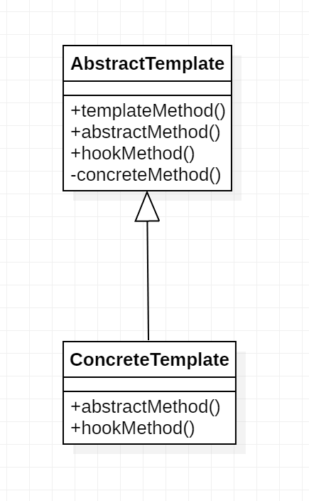

### 模板方法模式

> 基于继承的代码复用的基本技术

**意图：**定义一个操作中的算法的骨架，而将一些步骤延迟到子类中。模板方法使得子类可以不改变一个算法的结构即可重定义该算法的某些特定步骤。

**主要解决：**一些方法通用，却在每一个子类都重新写了这一方法。

**何时使用：**有一些通用的方法。

**如何解决：**将这些通用算法抽象出来。

**关键代码：**在抽象类实现，其他步骤在子类实现。

**应用实例：** 1、在造房子的时候，地基、走线、水管都一样，只有在建筑的后期才有加壁橱加栅栏等差异。 2、西游记里面菩萨定好的 81 难，这就是一个顶层的逻辑骨架。 3、spring 中对 Hibernate 的支持，将一些已经定好的方法封装起来，比如开启事务、获取 Session、关闭 Session 等，程序员不重复写那些已经规范好的代码，直接丢一个实体就可以保存。

**优点：** 1、封装不变部分，扩展可变部分。 2、提取公共代码，便于维护。 3、行为由父类控制，子类实现。

**缺点：**每一个不同的实现都需要一个子类来实现，导致类的个数增加，使得系统更加庞大。

**使用场景：** 1、有多个子类共有的方法，且逻辑相同。 2、重要的、复杂的方法，可以考虑作为模板方法。

**注意事项：**为防止恶意操作，一般模板方法都加上 final 关键词。



**抽象模板(Abstract Template)角色有如下责任：**

　　■　　定义了一个或多个抽象操作，以便让子类实现。这些抽象操作叫做基本操作，它们是一个顶级逻辑的组成步骤。

　　■　　定义并实现了一个模板方法。这个模板方法一般是一个具体方法，它给出了一个顶级逻辑的骨架，而逻辑的组成步骤在相应的抽象操作中，推迟到子类实现。顶级逻辑也有可能调用一些具体方法。

　　**具体模板(Concrete Template)角色又如下责任：**

　　■　　实现父类所定义的一个或多个抽象方法，它们是一个顶级逻辑的组成步骤。

　　■　　每一个抽象模板角色都可以有任意多个具体模板角色与之对应，而每一个具体模板角色都可以给出这些抽象方法（也就是顶级逻辑的组成步骤）的不同实现，从而使得顶级逻辑的实现各不相同。

```java
public abstract class AbstractTemplate {
    /**
     * 模板方法
     */
    public void templateMethod(){
        //调用基本方法
        abstractMethod();
        hookMethod();
        concreteMethod();
    }
    /**
     * 基本方法的声明（由子类实现）
     */
    protected abstract void abstractMethod();
    /**
     * 基本方法(空方法)
     */
    protected void hookMethod(){}
    /**
     * 基本方法（已经实现）
     * 防止魔改，所以用final禁止继承
     */
    private final void concreteMethod(){
        //业务相关的代码
    }
}

```

```java
public class ConcreteTemplate extends AbstractTemplate{
    //基本方法的实现
    @Override
    public void abstractMethod() {
        //业务相关的代码
    }
    //重写父类的方法
    @Override
    public void hookMethod() {
        //业务相关的代码
    }
}
```

模板模式的关键是：**子类可以置换掉父类的可变部分，但是子类却不可以改变模板方法所代表的顶级逻辑。**

每当定义一个新的子类时，不要按照控制流程的思路去想，而应当按照“责任”的思路去想。换言之，应当考虑哪些操作是必须置换掉的，哪些操作是可以置换掉的，以及哪些操作是不可以置换掉的。使用模板模式可以使这些责任变得清晰。

#### 模板方法模式中的方法

　　模板方法中的方法可以分为两大类：模板方法和基本方法。

#####　　模板方法

　　一个模板方法是定义在抽象类中的，把基本操作方法组合在一起形成一个总算法或一个总行为的方法。

　　一个抽象类可以有任意多个模板方法，而不限于一个。每一个模板方法都可以调用任意多个具体方法。

##### 　　基本方法

　　基本方法又可以分为三种：抽象方法(Abstract Method)、具体方法(Concrete Method)和钩子方法(Hook Method)。

　　●　　**抽象方法：**一个抽象方法由抽象类声明，由具体子类实现。在Java语言里抽象方法以abstract关键字标示。

　　●　　**具体方法：**一个具体方法由抽象类声明并实现，而子类并不实现或置换。

　　●　　**钩子方法：**一个钩子方法由抽象类声明并实现，而子类会加以扩展。通常抽象类给出的实现是一个空实现，作为方法的默认实现。

　　在上面的例子中，AbstractTemplate是一个抽象类，它带有三个方法。其中abstractMethod()是一个抽象方法，它由抽象类声明为抽象方法，并由子类实现；hookMethod()是一个钩子方法，它由抽象类声明并提供默认实现，并且由子类置换掉。concreteMethod()是一个具体方法，它由抽象类声明并实现。

#####　　默认钩子方法

　　一个钩子方法常常由抽象类给出一个空实现作为此方法的默认实现。这种空的钩子方法叫做“Do Nothing Hook”。显然，这种默认钩子方法在缺省适配模式里面已经见过了，一个缺省适配模式讲的是一个类为一个接口提供一个默认的空实现，从而使得缺省适配类的子类不必像实现接口那样必须给出所有方法的实现，因为通常一个具体类并不需要所有的方法。

##### 　　命名规则

　　命名规则是设计师之间赖以沟通的管道之一，使用恰当的命名规则可以帮助不同设计师之间的沟通。

　　钩子方法的名字应当以do开始，这是熟悉设计模式的Java开发人员的标准做法。在上面的例子中，钩子方法hookMethod()应当以do开头；在HttpServlet类中，也遵从这一命名规则，如doGet()、doPost()等方法。

#### 项目中使用

根据项目中的使用情况，模板方法可以用在SDK的接入的地方。

业务介绍，由于登录和支付无论哪个渠道都会有这个功能，为了更好的扩展渠道sdk，也防止在项目中出现过多的耦合，我们的思路就是定义一个抽象的模板父类，留有登录和支付的功能空方法，然后子类sdk接入的时候就继承实现子类的登录和支付功能。而业务中只需要调用模板父类的登录和支付就可以了，子类我们按照规则接入，最大限度降低sdk接入的耦合性。

目前我们在H5捕鱼上面的sdk接入方式设计的就是模板方法设计模式，具体代码设计到项目内容就不贴到外网展示了。